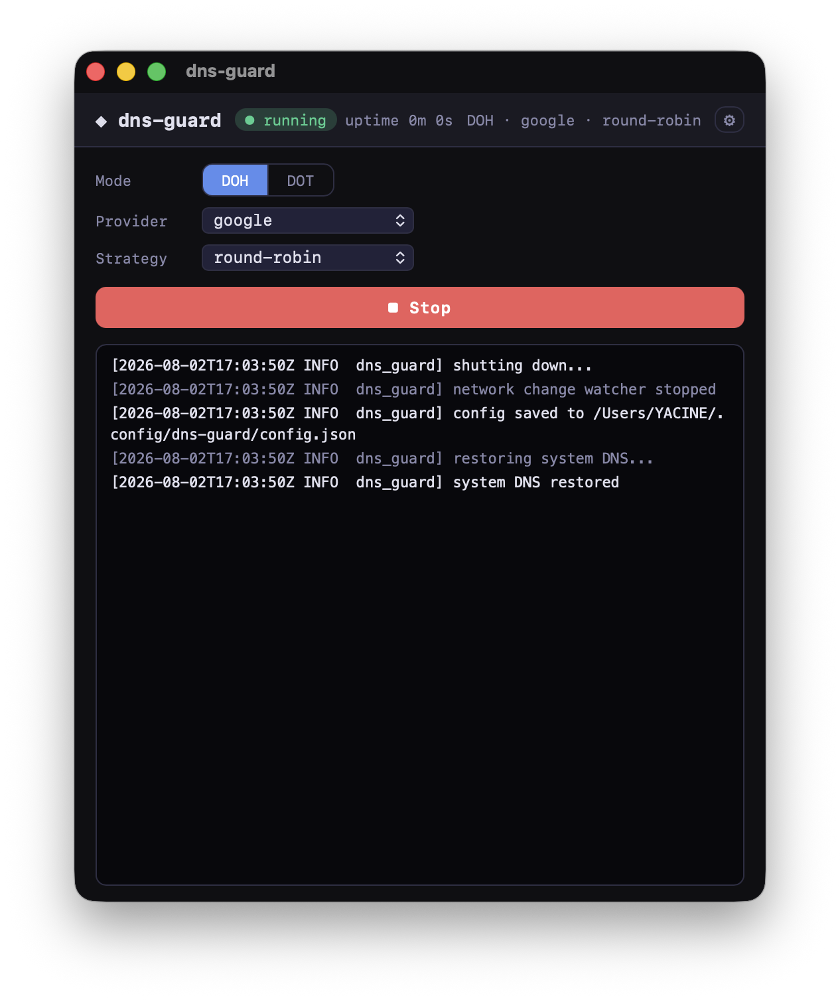

# dns-guard

System-wide encrypted DNS proxy. Routes all DNS traffic through DNS-over-HTTPS (DoH) or DNS-over-TLS (DoT) to Cloudflare, Google, or Quad9 — with a native macOS GUI, a CLI, and a gRPC control API.

**macOS** · **Linux** · **Windows**

## Two ways to use it

| | GUI (macOS) | CLI |
|---|---|---|
| Control | Native app with Touch ID / password admin prompts | Terminal commands |
| Proxy | Root-spawned, daemon-supervised, auto-adopted | Foreground or `--background` daemon |
| Live logs | Built-in log viewer | `dns-guard logs` |
| Config hot-swap | Dropdowns, applied live | `start`/`set-config` flags |

Both paths use the same proxy binary and the same gRPC daemon under the hood.



---

## 1. GUI (macOS)

**Requirements:** macOS 11+ (Apple Silicon or Intel), admin account.

1. Download **`dns-guard_<version>_aarch64.dmg`** (Apple Silicon) from the [releases page](https://github.com/boukaba/dns-guard/releases).
2. Open the DMG and drag **dns-guard** to Applications.
3. Ad-hoc signed build (no Apple Developer ID): on first launch, right-click the app → **Open** → **Open** (or System Settings → Privacy & Security → Open Anyway).
4. Launch the app. Click **Start**.
5. macOS shows the native admin panel — **Touch ID or password**. This happens once; the grant is cached, so later operations (Stop, provider changes) usually don't re-prompt.
6. DNS is now encrypted — verify with `dig example.com` (answers come via your chosen provider).

**Changing settings while running (all live, no restart):**
- **Provider** — Cloudflare / Google / Quad9
- **Strategy** — Single (sticky), Round-Robin, or Failover (auto-advances on provider errors)
- **Mode** — DoH or DoT

**Stopping:** click **Stop** — system DNS is restored. Closing the app leaves the proxy running if no admin grant is cached; the next launch re-adopts it.

---

## 2. CLI

### 2a. Direct mode (simplest)

Runs the proxy in your terminal, foreground:

```bash
sudo dns-guard --mode doh --provider cloudflare --strategy single
```

- `Ctrl+C` restores system DNS and exits.
- Flags persist to `~/.config/dns-guard/config.json`, so the next run can be just `sudo dns-guard`.
- `--background` daemonizes: logs go to `~/.config/dns-guard/proxy.log`, state to `state.json`. Stop it with `sudo kill -INT <pid>` (the pid is in `state.json`).

```bash
# One-shot: set system DNS to the proxy and exit
sudo dns-guard --install

# Restore default DNS
sudo dns-guard --uninstall
```

### 2b. Daemon + client (recommended for scripting)

Start the silent gRPC daemon once, then control it from any terminal:

```bash
# 1. Start the daemon (double-fork, writes server.pid)
dns-guard serve --daemon

# 2. Store the admin password (validated via `sudo -S -v`, kept in memory only)
dns-guard set-password --password 'your-sudo-password'

# 3. Start the proxy (daemon sudo-spawns it, captures its logs)
dns-guard start --mode doh --provider quad9 --strategy failover

# 4. Check status
dns-guard status
# → {"running":true,"pid":8421,"mode":"doh","provider":"quad9","strategy":"failover"}  (with --json)

# 5. Tail logs (streams proxy output, keeps a 500-line history)
dns-guard logs

# 6. Stop
dns-guard stop
```

`--json` prints machine-parseable JSON on `start`, `stop`, `status` — handy for scripts. `--addr <socket>` overrides the socket (default: `~/.config/dns-guard/dns-guard.sock`, also `DNS_GUARD_SOCKET`).

### CLI reference

| Command | Description |
|---|---|
| `dns-guard --mode <doh\|dot> --provider <cloudflare\|google\|quad9> --strategy <single\|round-robin\|failover>` | Direct mode: run proxy in foreground |
| `... --background` | Direct mode, daemonized (log: `proxy.log`) |
| `dns-guard --install` / `--uninstall` | Set / restore system DNS, then exit |
| `dns-guard serve [--daemon] [--listen SOCKET]` | gRPC control daemon (daemon = background) |
| `dns-guard start [--mode] [--provider] [--strategy] [--addr]` | Tell the daemon to start the proxy |
| `dns-guard stop [--addr]` | Tell the daemon to stop the proxy |
| `dns-guard status [--addr]` | Running? pid, mode, provider, strategy |
| `dns-guard logs [--addr]` | Tail live proxy logs |
| `dns-guard stats [--addr]` | Query aggregates: totals, blocked, per-provider, top domains |
| `dns-guard policy [--addr]` | List block/allow rules |
| `dns-guard policy --block DOMAIN` / `--allow DOMAIN` / `--clear` | Add a rule / remove all rules (applied live) |
| `dns-guard set-password --password PW [--addr]` | Store sudo password in the daemon |
| `-v, --verbose` | Debug logging |
| `--state-dir DIR` | Override state/config/log directory (`DNS_GUARD_DIR` env) |
| `--json` | JSON output for start/stop/status/stats/policy |

---

## 3. Control API

The daemon (`dns-guard serve`) exposes a **gRPC service** on a Unix socket (`~/.config/dns-guard/dns-guard.sock`, chmod 0600, owner-only) **and a JSON REST API** on `http://127.0.0.1:8090` (self-describing: `GET /openapi.yaml`). The GUI and CLI client commands are thin wrappers over them — you can drive dns-guard from any gRPC-capable language, a plain HTTP client, or an AI agent that reads the OpenAPI spec.

### REST (agents / scripts)

| Endpoint | Description |
|---|---|
| `GET /api/v1/status` | Running? pid, mode, provider, strategy |
| `POST /api/v1/start` `{mode, provider, strategy}` | Start the proxy (needs password set via gRPC `SetPassword`) |
| `POST /api/v1/stop` | Stop the proxy, restore DNS |
| `POST /api/v1/config` `{mode, provider, strategy}` | Hot-swap live — no restart, no password |
| `GET /api/v1/policy` / `PUT /api/v1/policy` `{rules:[{pattern, action}]}` | Read / replace block & allow rules (live) |
| `GET /api/v1/stats` | Query aggregates: totals, cached, blocked, errors, per-provider, top domains |
| `GET /api/v1/queries` | Recent query records (ring of 500) |
| `GET /api/v1/queries/stream` | Live query feed (SSE, event `query`) |
| `GET /api/v1/logs` / `GET /api/v1/logs/stream` | Recent log lines / live log feed (SSE, event `log`) |
| `GET /openapi.yaml` | Full OpenAPI spec (also served to discover the API) |

Policy rules: `pattern` matches the domain and its subdomains (`"example.com"` → `example.com` + `*.example.com`); `action` is `allow` or `block`. Allow rules override block rules; the default is allow. Blocked queries get NXDOMAIN.

```bash
# Block a tracker domain, live
curl -X PUT http://127.0.0.1:8090/api/v1/policy \
  -d '{"rules":[{"pattern":"ads.example.com","action":"block"}]}'

# Watch live DNS traffic
curl -N http://127.0.0.1:8090/api/v1/queries/stream
```

`DNS_GUARD_HTTP_PORT` overrides the port (default 8090); `DNS_GUARD_HTTP=0` disables the REST API entirely.

### gRPC

Service `dns_guard.DnsGuard` ([proto](proto/dns_guard.proto)):

| RPC | Request → Response | Description |
|---|---|---|
| `Start` | `StartRequest{mode, provider, strategy}` → `StartResponse{ok, message}` | Spawn the proxy with sudo (password from `SetPassword`) |
| `Stop` | `StopRequest{}` → `StopResponse{ok, message}` | SIGINT the proxy, wait for DNS restore |
| `Status` | `StatusRequest{}` → `StatusResponse{running, pid, mode, provider, strategy}` | Also **adopts** a live proxy (e.g. one the GUI spawned as root) |
| `SetConfig` | `ConfigRequest{mode, provider, strategy}` → `ConfigResponse{ok}` | Hot-swap config live — no restart, no password needed |
| `Logs` | `LogsRequest{}` → `stream LogEntry{line}` | Server-streaming logs (500-line history + live lines) |
| `SetPassword` | `PasswordRequest{password}` → `PasswordResponse{ok, message}` | Store sudo password (validated with `sudo -S -v`) |
| `Shutdown` | `ShutdownRequest{}` → `ShutdownResponse{ok}` | Stop the proxy (if possible) and exit the daemon |
| `WatchQueries` | `WatchQueriesRequest{}` → `stream QueryRecord{domain, provider, mode, strategy, rtt_ms, cached, blocked, error, ts_ms}` | Live per-query feed (500-record history + live records) |
| `SetPolicy` | `Policy{rules:[{pattern, action}]}` → `PolicyResponse{ok, message}` | Replace block/allow rules live — no password needed |
| `GetPolicy` | `GetPolicyRequest{}` → `Policy` | Read the current rules |
| `GetStats` | `GetStatsRequest{}` → `Stats{queries_total, cached_total, blocked_total, errors_total, per_provider, top_domains}` | Query aggregates for the current proxy session |

**Quick check with [grpcurl](https://github.com/fullstorydev/grpcurl):**

```bash
# List services / reflect
grpcurl -unix -plaintext ~/.config/dns-guard/dns-guard.sock list

# Status
grpcurl -unix -plaintext ~/.config/dns-guard/dns-guard.sock \
  dns_guard.DnsGuard/Status

# Hot-swap config live
grpcurl -unix -plaintext -d '{"provider":"quad9","strategy":"failover"}' \
  ~/.config/dns-guard/dns-guard.sock dns_guard.DnsGuard/SetConfig

# Stream logs
grpcurl -unix -plaintext ~/.config/dns-guard/dns-guard.sock \
  dns_guard.DnsGuard/Logs

# Block a domain live
grpcurl -unix -plaintext -d '{"rules":[{"pattern":"ads.example.com","action":"BLOCK"}]}' \
  ~/.config/dns-guard/dns-guard.sock dns_guard.DnsGuard/SetPolicy
```

**Python example** (using `grpcio` + generated stubs):

```python
import grpc
import dns_guard_pb2, dns_guard_pb2_grpc

ch = grpc.insecure_channel("unix://" + "/Users/you/.config/dns-guard/dns-guard.sock")
stub = dns_guard_pb2_grpc.DnsGuardStub(ch)
print(stub.Status(dns_guard_pb2.StatusRequest()))
stub.SetConfig(dns_guard_pb2.ConfigRequest(provider="google", strategy="single"))
```

---

## Providers

| Provider | DoH | DoT |
|---|---|---|
| Cloudflare | `https://cloudflare-dns.com/dns-query` | `1.1.1.1:853` |
| Google | `https://dns.google/dns-query` | `8.8.8.8:853` |
| Quad9 | `https://dns.quad9.net/dns-query` (HTTP/2) | `9.9.9.9:853` |

Strategies: **single** (sticky provider), **round-robin** (rotate per query), **failover** (advance provider on error).

## Files & state

Everything lives in `~/.config/dns-guard/` (`--state-dir` / `DNS_GUARD_DIR` to override):

| File | Purpose |
|---|---|
| `config.json` | Last-used mode / provider / strategy + block/allow policy (CLI flags override; policy hot-swaps live) |
| `state.json` | Proxy pid + running state (written by the proxy itself) |
| `query.log` | Per-query event log (JSON lines, tailed by the daemon for WatchQueries/GetStats) |
| `proxy.log` | Direct-mode `--background` logs |
| `server.log` | Daemon logs |
| `dns-guard.sock` | gRPC control socket (0600, owner-only) |
| `server.pid` | Daemon pid |

## How it works

1. **DNS install** — system DNS is pointed at `127.0.0.2` (native API per platform: `networksetup`/`SCDynamicStore` on macOS, `/etc/resolv.conf`/netlink on Linux, `netsh`/`NotifyIpInterfaceChange` on Windows)
2. **Proxy** — listens on port 53, forwards each query via DoH/DoT (TTL-cached, failover-aware)
3. **Hot-swap** — the proxy polls `config.json` every 500 ms; provider/strategy changes apply live, mode changes re-enter the loop
4. **Watcher** — re-applies DNS on network interface changes
5. **Cleanup** — restores original DNS and removes the loopback alias on exit

## Requirements

- **macOS 11+ / Linux / Windows** — root privileges (port 53 + DNS configuration)
- **Rust** only if building from source

## Build from source

```bash
git clone https://github.com/boukaba/dns-guard.git
cd dns-guard
cargo build --release
sudo ./target/release/dns-guard --mode doh
```

GUI (macOS): copy the release binary into `src-tauri/binaries/dns-guard`, then `cd dns-guard-gui && cargo tauri build`.

## License

MIT
